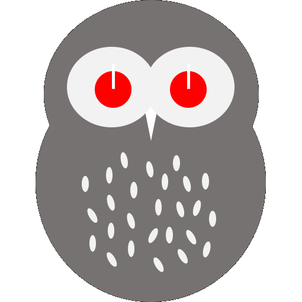

# togowl-next



Togowl is task and life management tools for next generation owls.  
It integrates with Toggl, Todoist and Slack.

<div style="display: flex;">
  
  
  
  
</div>

## For developers

### Clone

Clone this repository.

### Install dependencies

```bash
$ npm run install
```

### Create your app on firebase

Create togowl app on firebase as different name (ex: yourtogowl)

👉 https://console.firebase.google.com/

### Create `.firebase.config.json`

For example.

```json
{
  "apiKey": "AAAAAAAAAAAAAAAAAAAAAAAAAAAAAAAAAAAAAAA",
  "authDomain": "yourtogowl.firebaseapp.com",
  "databaseURL": "https://yourtogowl.firebaseio.com",
  "projectId": "yourtogowl",
  "storageBucket": "yourtogowl.appspot.com",
  "messagingSenderId": "777777777777",
  "appId": "1:666666666666:web:aaaaaaaaaaaaaaaaaaaaaa"
}
```

You can see in `Project Overview > Settings`

### Serve with hot reload at localhost:3000

```
$ npm run dev
```

### Tests

```
$ npm test
```

### Build for production and launch server

```
$ npm run build
$ npm run start
```

### Deploy

Before deploy, you need to login with your firebase account. (`firebase login`)

Then

```
$ npm run release
```
